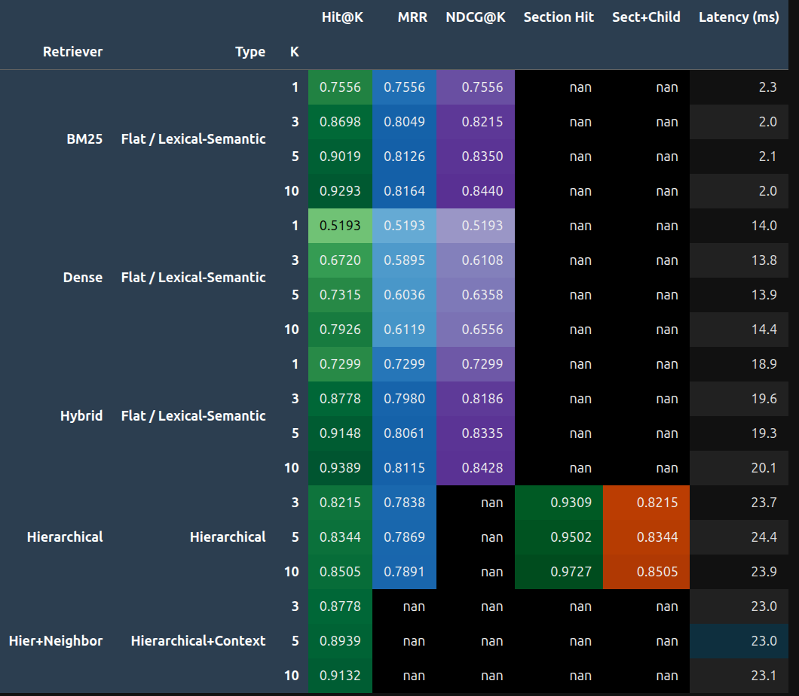
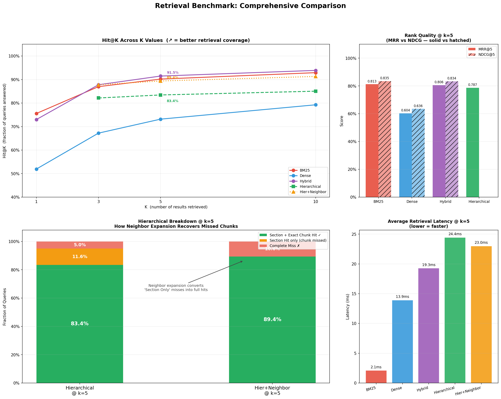

<p align="center">
  
</p>

# RAG Evaluation Framework

> A ground-up pipeline for building, benchmarking, and rigorously evaluating Retrieval-Augmented Generation systems — from PDF ingestion through RAGAS evaluation.

**Current Stage:** Retrieval Benchmarking Complete &nbsp;|&nbsp; **Next:** RAGAS End-to-End Evaluation

---

## What This Project Is

This is not a chatbot project. The goal is to rigorously measure every component of a RAG pipeline — from how documents are chunked to whether the final generated answer is actually correct.

The approach is deliberately ground-up: build the corpus, build the retrievers, generate the ground truth dataset by hand, benchmark exhaustively, then apply RAGAS. This gives full traceability from source chunk → Q&A pair → retrieval result → end-to-end answer quality — something off-the-shelf frameworks obscure.

The current V2 pipeline is built entirely in `src_v2/`. A previous iteration (V1, using Wikipedia + LangChain) revealed fundamental problems that made a rebuild necessary. That transition is explained in [Why We Rebuilt](#why-we-rebuilt-v1--v2).

---

## Project Roadmap

```
Stage 1: PDF Corpus & Document Ingestion             ✅  Complete
Stage 2: Section-Aware Hierarchical Chunking         ✅  Complete
Stage 3: Embedding Generation & Vector Store         ✅  Complete
Stage 4: Five Retrieval Strategies                   ✅  Complete
Stage 5: LLM-Generated Benchmark Dataset (627 Q&As)  ✅  Complete
Stage 6: Retrieval Benchmarking                      ✅  Complete  ← current
Stage 7: RAGAS End-to-End Evaluation                 🔄  Next
```

---

## Why We Rebuilt (V1 → V2)

Three root causes forced the rebuild from scratch.

**1. Naive chunking broke semantic units.**
`RecursiveCharacterTextSplitter` with a fixed size and overlap rolled a window across the raw document text, cutting across section boundaries, splitting tables mid-row, and bisecting LaTeX formulas. Chunks had no awareness of document structure — a paragraph could end in one chunk and its concluding sentence begin in the next.

**2. Wikipedia was the wrong corpus.**
Wikipedia articles are noisy: citation markers, redirect stubs, heavily cross-linked prose, and mathematical notation that does not survive plain-text extraction. The corpus introduced irrelevant matches that polluted retrieval results and made evaluation misleading.

**3. The evaluation methodology measured the wrong thing.**
Matching a retrieved chunk ID against one "expected" chunk from hundreds of candidates — when a question about transformers could reasonably be answered by many different chunks — produced near-zero recall that did not reflect actual retrieval quality. The metric was too strict in the wrong way.

**V2 addressed all three:** curated PDF corpus + Docling-based structure-aware parsing + section-aware chunking + ground truth generated from the exact source chunk so each question has one verifiable, traceable correct answer.

---

## Pipeline Stages

Eight stages transform raw PDFs into benchmark-ready retrieval results.

| # | Stage | Tool(s) | Input | Output |
|---|-------|---------|-------|--------|
| 1 | PDF Ingestion | Docling | Raw PDFs (13 docs) | Markdown with LaTeX formulae intact |
| 2 | Section Parsing + Hierarchy | MarkdownSectionParser → LevelInference → HierarchyBuilder | Markdown string | `Document` with nested `Section` tree |
| 3 | Normalization | SectionFlattener | Nested Section tree | `List[FlattenedSection]` with pre-computed breadcrumb paths |
| 4 | Section-Aware Chunking | SectionChunker + StructurePreserver | FlattenedSections | `List[Chunk]` — three types: `parent_section`, `table_fragment`, `section_fragment` |
| 5 | Embedding | OllamaEmbeddingGenerator (nomic-embed-text) | Chunks | `List[ChunkEmbedding]` |
| 6 | Vector Store | ChromaStore (ChromaDB) | ChunkEmbeddings | Persisted similarity index |
| 7 | Synthetic Q&A Generation | Qwen3:8B via Ollama | Chunks | 627 Q&A pairs in JSONL cache |
| 8 | Retrieval + Evaluation | 5 Retrievers + 3 Evaluators | QuestionSamples | Hit@K, MRR, NDCG, Section Hit, Latency |

**The data transformation story:** A raw PDF becomes a `Document` (root container with metadata). The document's heading structure is parsed into a nested `Section` tree. That tree is flattened into `List[FlattenedSection]` — each section pre-annotated with its full breadcrumb path (e.g. `"lbdl > Chapter 3 > Optimization"`). The chunker then transforms each section into one or more `Chunk` objects — the atomic unit for embedding and retrieval. Finally, each chunk is embedded into a vector and stored in ChromaDB.

---

## Strategies at Each Stage

### Chunking Strategies

The chunker applies a three-tier decision based on section size:

```
Section content length?
├── ≤ 2,500 chars
│   └── Single parent_section chunk  (fragment_index = -1, meaning "atomic, not split")
│
└── > 2,500 chars
    ├── Always create: parent_section chunk  (full section text — used by hierarchical retrieval)
    │
    └── Also create fragment children:
        │
        ├── Tables  (StructurePreserver)
        │   ├── Table ≤ 3,000 chars → single atomic table_fragment chunk
        │   └── Table > 3,000 chars → row-by-row table_fragment chunks
        │         └── Header Duplication: every fragment = header_row + separator_row + data_rows
        │             (a row of "| 0.75 | 0.83 |" is meaningless without its column names)
        │
        └── Remaining text → RecursiveCharacterTextSplitter (size=1,200, overlap=200)
              └── section_fragment chunks, fragment_index = 0, 1, 2 ...
                    └── Sequential fragment_index enables neighbor retrieval later
```

**Table-aware extraction** — Markdown tables are detected by the presence of `|` pipe characters. Small tables are preserved as a single atomic chunk (schema intact). Large tables are split at row boundaries, never mid-row, into ~1,500-character fragments.

**Header duplication** — When a large table is fragmented, every fragment gets the original header row and separator row prepended: `header + "\n" + separator + "\n" + data_rows`. This makes each fragment self-interpreting when retrieved in isolation.

**Formula protection** — LaTeX blocks (`$$...$$`) are replaced with `__FORMULA_N__` placeholders before text splitting and restored afterward. This prevents a formula from being cut mid-expression by the character-based splitter.

**Why not a sliding window?** — Fixed-size windows roll across the full document, crossing section boundaries. Section-aware chunking treats each section as the atomic semantic unit — small sections are never fragmented, and fragments never contain content from two different sections.

---

### Retrieval Strategies

Five strategies are implemented, each building on the previous:

| Strategy | Approach | Score | Key Design |
|----------|----------|-------|------------|
| BM25 | Lexical (Okapi BM25) | Raw, 0–∞ | In-memory; no vector store dependency |
| Dense | Semantic (nomic-embed-text) | Cosine similarity, 0–1 | Retrieves k×3 before filtering bad sections |
| Hybrid | Dense + BM25 fusion | Fused, 0–1 | Min-max normalization per retriever, then 50/50 weighted sum |
| Hierarchical | Hybrid → parent section context | Fused, 0–1 | Pre-built `(doc_id, section_id) → Chunk` dict for O(1) parent lookup |
| Hier+Neighbor | Hierarchical + fragment window | — | Expands to ±1 fragment siblings using `fragment_index` (section-local, never crosses boundaries) |

**Score normalization in Hybrid** — BM25 scores are unbounded [0, ∞); Dense scores are cosine similarity [0, 1]. Without normalization, BM25 magnitudes would dominate the fusion. Min-Max normalization applied independently per retriever: `(score − min) / (max − min)`, then `fused = 0.5 × dense_norm + 0.5 × bm25_norm`.

**Two flavours of neighbor retrieval** — `NeighborRetriever` uses global `chunk_order` (a monotonic counter) to find adjacent chunks; this can cross section boundaries. `NeighborHierarchicalRetriever` uses `fragment_index` (section-local counter) to expand only within the same section — the version used in benchmarking.

**Candidate over-retrieval** — All retrievers retrieve more candidates than k before filtering. Reference sections, bibliographies, and indices are excluded via the centralized `BAD_SECTIONS` config. Over-retrieval guarantees k clean results remain after filtering.

---

### Question Generation Strategy

- **One Q&A per chunk** — avoids questions where multiple chunks give equivalent answers, which would make ground truth ambiguous.
- **Prompt engineering** — the generation prompt explicitly bans phrases like "According to the text" or "In this section," forcing standalone natural-language questions a real user might ask.
- **Skip logic** — chunks with insufficient content (very short fragments, context-free table rows) return `{"status": "skip"}` and are excluded from the evaluation dataset.
- **Resumable JSONL cache** — generation results are appended one record at a time to a JSONL file. If the process is interrupted, it resumes from the last completed chunk — no LLM calls are repeated, no data is lost.

---

## src_v2 Folder Stories

Every folder in `src_v2/` has a specific responsibility. Here is the story of each one.

### `models/` — The Schema Layer

Pure dataclasses with no behavior. Defines the full data hierarchy:

```
Document
└── Section (nested tree, preserves heading hierarchy)
    └── FlattenedSection (tree → flat list, path pre-computed)
        └── Chunk (atomic unit for embedding + retrieval)
            └── ChunkEmbedding (Chunk + its dense vector)
```

Three result types exist because three retrieval paradigms return different shapes of data:
- `RetrievalResult` — flat retrievers (Dense, BM25, Hybrid): `chunk + score + retriever_name`
- `HierarchicalRetrievalResult` — Hierarchical retriever: `parent_chunk + child_chunk + score`
- `NeighborRetrievalResult` — NeighborRetriever: `center_chunk + neighbor_chunks + score`

Everything between pipeline stages is typed. No raw dicts are passed between components.

---

### `parsers/` — The Document Understanding Layer

Four classes form a sequential pipeline:

1. **DoclingParser** — converts a PDF file to a Markdown string using Docling with formula enrichment enabled. This preserves heading levels as `#`/`##` and LaTeX as `$$...$$`.
2. **MarkdownSectionParser** — regex-matches heading lines and builds a nested `Section` tree, assigning `parent_section_id` from a stack as it descends through heading levels.
3. **LevelInference** — infers section depth from title numbering patterns (e.g. "3.2.1 Introduction" → level 3) for documents that use numbered headings instead of Markdown heading levels.
4. **HierarchyBuilder** — validates and rebuilds parent-child relationships from section levels; corrects any inconsistencies introduced by the parser.

Together they transform raw PDF bytes into a typed, hierarchical `Document` object.

---

### `normalization/` — The Bridge Layer

`SectionFlattener` converts the nested `Section` tree into a flat `List[FlattenedSection]`. For each section it pre-computes the full breadcrumb path (e.g. `"lbdl > Chapter 3 > Stochastic Gradient Descent"`) and records `parent_section_id`.

This layer exists so chunking receives a simple flat list. The chunker never needs to traverse the tree — all the ancestry information is already embedded in each `FlattenedSection`.

---

### `chunking/` — The Fragmentation Layer

`SectionChunker` orchestrates the three-tier strategy (small section → atomic, large section → parent + fragments). `StructurePreserver` handles everything structure-sensitive: table detection, large-table fragmentation with header duplication, and formula placeholder substitution.

The key output fields on every `Chunk`:
- `chunk_type` — `parent_section`, `table_fragment`, or `section_fragment`
- `fragment_index` — `-1` for atomic parent sections; `0, 1, 2…` for ordered fragments
- `parent_section_id` — links every fragment back to its originating section

These three fields are what make hierarchical and neighbor retrieval possible downstream.

---

### `embedding/` — The Vectorization Layer

Stateless: takes a `Chunk`, returns a vector. `OllamaEmbeddingGenerator` calls the local Ollama server with `nomic-embed-text`. No API keys, no cost, fully deterministic and reproducible. The model name and vector dimension are stored in an `EmbeddingModel` dataclass.

---

### `vectorstore/` — The Index Layer

`ChromaStore` wraps ChromaDB. Each entry stores `(chunk_id, embedding, metadata_dict)` where the metadata dict contains all `Chunk` fields. This inline metadata storage means retrieved results can reconstruct full `Chunk` objects without a secondary database lookup.

---

### `config/` — The Settings Layer

`retrieval_config.py` is a single file with three things:
- `BAD_SECTIONS` — set of section titles to exclude: `references`, `bibliography`, `contents`, `index`, `list of figures`, `list of tables`
- `EXCLUDE_REFERENCE_SECTIONS` — boolean flag
- `is_bad_section(title)` — normalizes title to lowercase alphanumeric, checks membership

All five retrievers import from here. Without centralized filtering, BM25 retrieves bibliography entries because they contain topic-related keywords; Dense retrieves index pages because they share vocabulary with queries.

---

### `retrieval/` — The Strategy Layer

Five strategies arranged by composition depth:

```
BM25Retriever          ← in-memory lexical matching, no vector store
DenseRetriever         ← semantic matching via embedding + ChromaDB
HybridRetriever        ← composes Dense + BM25, normalizes + fuses scores
HierarchicalRetriever  ← wraps Hybrid, promotes results to parent section context
NeighborHierarchicalRetriever  ← wraps Hierarchical, expands to sibling fragments
```

`BM25Retriever` and `DenseRetriever` extend `BaseRetriever` (abstract class enforcing `retrieve(query, k)`). The remaining three compose by duck typing — they accept any object with a `retrieve()` method.

---

### `evaluation/` — The Metrics Layer

`retrieval_metrics.py` contains three pure functions: `hit_at_k`, `reciprocal_rank`, `ndcg_at_k`. No state, no side effects.

Three evaluator classes exist because each retriever returns a different result type:

| Evaluator | Used with | Result type | Metrics |
|-----------|-----------|-------------|---------|
| `RetrievalEvaluator` | Dense, BM25, Hybrid | `List[RetrievalResult]` | Hit@K, MRR, NDCG@K, Latency |
| `HierarchicalRetrievalEvaluator` | Hierarchical | `List[HierarchicalRetrievalResult]` | Child Hit@K, Section Hit@K, Sect+Child, MRR, Latency |
| `NeighborHierarchicalRetrievalEvaluator` | NeighborHierarchical | `List[Chunk]` | Child Hit@K, Latency |

---

### `question_generation/` — The Dataset Layer

Turns `List[Chunk]` into 627 evaluation Q&A pairs with full ground truth traceability.

- `QuestionGenerator` — wraps Qwen3:8B; generates one Q&A per chunk with engineered prompts
- `QuestionDatasetBuilder` — orchestrates generation with resumability via `get_completed_chunk_ids()`
- `question_cache.py` — JSONL persistence; append-only so the file survives mid-run interruptions
- `QuestionDatasetLoader` — filters the cache to `status=success` records and returns `List[QuestionSample]`

---

### `cache/` — The Persistence Layer

Two different caching formats serving two different failure modes:

- **Pickle (`parser_cache.py`)** — binary, fast, stores `Document` objects post-Docling. Docling parsing can take 30+ seconds per PDF; the cache avoids re-running it every session.
- **JSONL (`question_cache.py`)** — text, append-only, human-readable. LLM generation can fail mid-run; JSONL means each completed record is immediately safe. A full-file rewrite (as JSON would require) would lose data on a crash.

---

### `preprocessing/` — The Cleaning Layer

`formula_cleaner.py` pre-processes LaTeX content before it reaches Docling, removing or normalizing malformed formula syntax that would produce parsing artifacts in the rendered Markdown output.

---

### `validation/` — The Audit Layer

`ChunkAuditor` validates chunk integrity after chunking completes. It checks for empty chunks, missing IDs, malformed `fragment_index` values, and parent-child consistency. Catches issues before they silently corrupt the vector store.

---

## Benchmark Results

Results from `experiments/experiments/data/benchmark_results.json`, measured across 627 evaluation samples.

### Numbers

| Retriever | Type | Hit@1 | Hit@3 | Hit@5 | Hit@10 | MRR@5 | NDCG@5 | Section Hit@5 | Latency@5 |
|-----------|------|-------|-------|-------|--------|-------|--------|---------------|-----------|
| BM25 | Flat | 75.6% | 87.0% | 90.2% | 92.9% | 81.3% | 83.5% | — | 2.1 ms |
| Dense | Flat | 51.9% | 67.2% | 73.2% | 79.3% | 60.4% | 63.6% | — | 13.9 ms |
| Hybrid | Flat | 73.0% | 87.8% | 91.5% | 93.9% | 80.6% | 83.3% | — | 19.3 ms |
| Hierarchical | Hierarchical | — | 82.2% | 83.4% | 85.1% | 78.7% | — | 95.0% | 24.4 ms |
| Hier+Neighbor | Hier+Context | — | 87.8% | 89.4% | 91.3% | — | — | — | 23.0 ms |





---

### Are These Numbers Good? — An Objective Assessment

**What the numbers show:**
- Hybrid at 91.5% Hit@5 means 9 out of 10 queries find the right chunk in the top 5 results.
- Hierarchical at 95.0% Section Hit@5 means the correct document section is retrieved almost every time.
- Hier+Neighbor at 89.4% vs Hierarchical at 83.4% (+6%) confirms that expanding the context window to neighboring fragments meaningfully recovers missed chunks.

**Why these numbers are optimistic — three honest caveats:**

**1. BM25 has a structural advantage in this benchmark.**
The ground truth questions were generated by an LLM *from* the source chunks. The LLM naturally uses terminology from the chunk text, so BM25 (keyword matching) is predisposed to score well. The 75.6% vs 51.9% Hit@1 gap (BM25 vs Dense) likely overstates BM25's real-world advantage — on natural user queries that don't mirror chunk vocabulary, the gap would be smaller.

**2. Dense retrieval underperforms its potential here.**
`nomic-embed-text` runs locally via Ollama on CPU. Frontier embedding models (`text-embedding-3-large`, `BGE-M3`, `MXBAI`) would likely close the gap with BM25 significantly. The 51.9% Hit@1 reflects this local model limitation, not a ceiling on semantic retrieval.

**3. Single ground truth per question underestimates retrieval quality.**
Each question maps to exactly one "correct" chunk ID. Many questions can be correctly answered by multiple semantically similar chunks in the corpus. When a retriever returns a different-but-equally-valid chunk, the evaluation marks it as a miss. Hit@K underestimates actual retrieval usefulness — a point first identified in EXP01 and still true in V2.

**Bottom line:** The retrieval layer is working correctly within this benchmark setup. These numbers confirm the pipeline is functioning and that the five strategies are meaningfully differentiated. RAGAS will give a more honest end-to-end assessment — it measures whether the final generated answer is actually correct, not whether a specific chunk ID was found.

---

## What's Next: RAGAS Evaluation Plan

RAGAS (Retrieval Augmented Generation Assessment) measures end-to-end RAG quality — not just whether the right chunk was retrieved, but whether the system produced a correct, faithful, relevant answer.

### The Four RAGAS Metrics

| Metric | Question it answers |
|--------|-------------------|
| **Faithfulness** | Does the generated answer stay within what the retrieved context actually says? Detects hallucination. |
| **Answer Relevancy** | Is the generated answer actually relevant to the question asked? |
| **Context Precision** | Of the retrieved chunks, what fraction are genuinely useful for answering the question? |
| **Context Recall** | Does the retrieved context contain all the information needed to construct the correct answer? |

### How We Will Run It

**Step 1 — Generate answers for all 627 samples, for each retriever.**

For each `(retriever, question)` pair:
1. Retrieve top-5 chunks using the retriever
2. Pass retrieved chunk content as context to Qwen3:8B
3. Generate an answer
4. Store: `question`, `answer`, `contexts` (list of chunk texts), `reference_answer` (ground truth)

**Step 2 — Run RAGAS evaluation.**

Feed the stored `(question, answer, contexts, reference_answer)` tuples to RAGAS. Output: per-question scores for Faithfulness, Answer Relevancy, Context Precision, Context Recall.

**Step 3 — Aggregate by retriever.**

Mean RAGAS scores per retriever → final comparison table.

This directly answers: *which retrieval strategy produces the best end-to-end RAG quality?*

### Why V2 Is RAGAS-Ready

- 627 Q&A pairs with `question`, `reference_answer`, and source `chunk_id` — exactly the inputs RAGAS requires
- Five retrievers ready to compare in one benchmark run
- `notebooks/ragas_eval.ipynb` already scaffolded (to be updated to use `src_v2` pipeline)
- Qwen3:8B already configured locally via Ollama for answer generation

### The Key Insight RAGAS Will Unlock

Hit@K tells us *a chunk was retrieved*. RAGAS tells us *whether the LLM used that chunk to produce a correct, faithful answer*. A retriever that scores high on Hit@K may still produce hallucinations if its retrieved context is noisy or misaligned with the question. That is the gap this stage will close.

---

## Project Structure

```
rag-evaluation-framework/
│
├── data/
│   └── documents/               # 13 curated PDFs (GenAI / RAG domain)
│
├── experiments/
│   ├── pipeline_validation.ipynb   # Main notebook — all V2 stages + benchmarking
│   └── experiments/data/
│       ├── benchmark_results.json         # Saved benchmark numbers
│       ├── Retrieval_Benchmark_Reults.png # Pandas styled results table
│       └── benchmark_chart.png            # 4-panel comparison chart
│
├── notebooks/
│   └── ragas_eval.ipynb         # RAGAS evaluation (next stage)
│
├── src_v2/                      # Core library
│   ├── models/                  # Dataclasses: Document, Section, Chunk, results
│   ├── parsers/                 # Docling → Markdown → Section tree
│   ├── normalization/           # Section tree → flat FlattenedSection list
│   ├── chunking/                # SectionChunker + StructurePreserver
│   ├── embedding/               # nomic-embed-text via Ollama
│   ├── vectorstore/             # ChromaDB wrapper
│   ├── config/                  # BAD_SECTIONS, retrieval settings
│   ├── retrieval/               # BM25, Dense, Hybrid, Hierarchical, Neighbor
│   ├── evaluation/              # Hit@K, MRR, NDCG, evaluator classes
│   ├── question_generation/     # Qwen3:8B Q&A generation + JSONL cache
│   ├── cache/                   # Pickle cache for parsed documents
│   ├── preprocessing/           # Formula cleaner
│   └── validation/              # Chunk auditor
│
└── artifacts/
    └── processtillnow.png       # V1 architecture diagram
```

---

## Tech Stack

| Component | Tool | Why |
|-----------|------|-----|
| PDF Parsing | [Docling](https://github.com/DS4SD/docling) | Formula-aware; preserves heading hierarchy from complex PDFs |
| LLM | Qwen3:8B via Ollama | Local, no API cost, strong instruction-following for Q&A generation |
| Embedding | nomic-embed-text via Ollama | Local, deterministic, reproducible — no cloud dependency |
| Vector Store | ChromaDB | Lightweight, local persistence, no infrastructure required |
| Lexical Retrieval | rank-bm25 (Okapi BM25) | Fast in-memory BM25, no external service |
| Text Splitting | LangChain `RecursiveCharacterTextSplitter` | Used only for text fragments within large sections |
| Evaluation Framework | RAGAS | Standard RAG evaluation library (next stage) |
| Language | Python 3.12 | — |

---

## Quick Start

```bash
# 1. Install dependencies
pip install -e .

# 2. Start Ollama and pull required models
ollama pull qwen3:8b
ollama pull nomic-embed-text

# 3. Run the pipeline
# Open and run experiments/pipeline_validation.ipynb from top to bottom
# - Cells 1–47:  PDF ingestion → chunking → embedding → vector store
# - Cells 48–101: Retriever setup + Q&A dataset generation
# - Cells 102–127: Retrieval evaluation
# - Cells 128–131: Full benchmark comparison + charts
```

---

---

## Version 1 Notes (Historical Context)

The following summarises the first iteration of this project, which used a LangChain-based pipeline on Wikipedia data. It is preserved here as context for the transition to V2.

- **Data source**: ~20 Wikipedia articles on ML/AI topics (Transformers, LLMs, Embeddings, Vector Databases, etc.) fetched via the Wikipedia API
- **Tech stack**: LangChain + ChromaDB + nomic-embed-text (same embedding model) + Qwen3:8B
- **Chunking**: `RecursiveCharacterTextSplitter` at chunk_size=1000, overlap=200
- **Retrieval evaluated**: Vector similarity search and BM25 (LangChain abstractions)
- **Evaluation metrics**: Exact Chunk Recall, Semantic Similarity (cosine ~0.63 average), LLM-as-a-Judge (~0.74 average)
- **Key finding**: Exact chunk recall severely underestimated retrieval quality — relevant answers came from chunks other than the "expected" source chunk
- **Key finding**: LLM-as-a-Judge scores correlated better with answer quality than embedding cosine similarity
- **Identified limitations**: No hybrid retrieval, no hallucination detection, Wikipedia noise, naive chunking, no section awareness
- **Outcome**: All identified limitations became the design requirements for V2
- **Reference links**: [Hallucination Detection Guide](https://oneuptime.com/blog/post/32026-01-30-hallucination-detection/view) · [LLM Eval Projects Guide](https://docs.google.com/document/d/1JrwCVhrDScXxZ_1l9s04TmSUj4BaptTU/mobilebasic)
